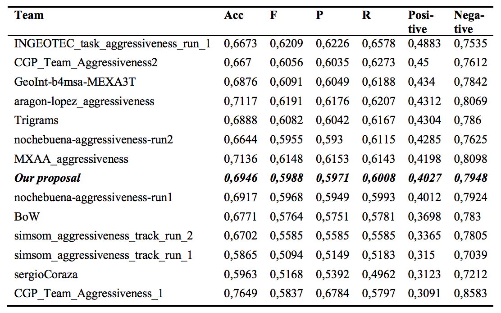

# AplicacionesLC
Practicas desarrolladas para la asignatura Aplicaciones de la Lingüística Computacional del Master IARFID de la UPV.

## Tareas
Para la ejecución de las tareas solo hay que ejecutar el script. Se debe de hacer la decsargas necesarias de NLT de la siguiente manera:
```python
import nltk
nltk.download('cess_esp')
nltk.download('stopwords')
```
```
python scripts/tareas/tarea_1.py
python scripts/tareas/tarea_2.py
python scripts/tareas/tarea_3.py
```

## Practicas:
### Practica 1
Objetivo: Manipulación de cadenas y uso de expresiones regulares para construir un tokenizador. Para ejecutar el script:
```
python scripts/practicas/practica1.py

```
**Python code**: [here](scripts/practicas/practica1.py)

### Practica2 (Sentiment Analysis):
Construir un sistema de SA para el español, usando tweets. Para ejecutar el script:
```
python scripts/practicas/practica2.py

```

**Python code**: [here](scripts/practicas/practica2.py)

## Proyecto final
This paper summarizes the shared task aggressive detection in Twitter organized as part of the MEX-A3T workshop. The aim of this task is to determine whether a tweet is aggressive or not. In tasks of lassifying small texts of social networks, as in many others, the use of bag of words can influence the performance of the models. In the Twitter context the formal and “slang” language are mixed increasing the number of synonyms and so the size of the bag of words.

Generalizing some expressions as insults or laughs can reduce the size of the bag of words without losing the linguistic meaning or the writer intention, and provide a generalization to some unseeing words in the training set. Being that and immense bag of words for short texts is too disperse (Fang, et al. 2014), the use of reductions of components improves even more the performance of the models, as many words have a lack importance in the aggressiveness task, or appear too few times. In this paper we will develop a linguistic generalization for the common slang Mexican used in tweets to reduce the impact of the size in the bag of words. As well as a PCA implementation to improve the computational cost in the training process. 

#### Results



**Jupyter Notebook**: [here](jupyter/SEAL.ipynb)

**Paper**: [here](http://ceur-ws.org/Vol-2150/MEX-A3T_paper5.pdf)

## Built With

* [Sklearn](http://scikit-learn.org/stable/) - Machine Learning Process
* [NLTK](http://www.nltk.org) - Natural Language Processing
* [Pandas](https://pandas.pydata.org) - Data structures and data analysis tools
* [Keras](https://github.com/keras-team/keras) - Frontend for Deeplearning
* [TensorFlow](https://github.com/tensorflow/tensorflow) - Bakend for Deeplearning


## Authors

* **Sebastian Correa Echeverri** [scorrea92 gitlab](https://gitlab.com/scorrea92) [scorrea92 github](https://github.com/scorrea92)
